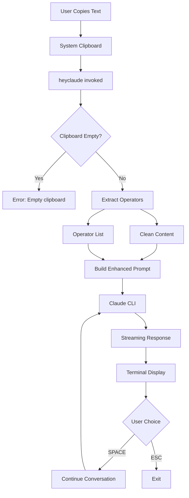

# Hey Claude - Data Flow Diagram

This document visualizes how data flows through the Hey Claude system, from user input to final output.

## High-Level Data Flow



## Detailed Data Transformation Pipeline

### 1. Input Stage
```
┌─────────────────────────────────────────────────────────┐
│                     USER ACTION                          │
│                                                          │
│  Copies: "brief: list: explain Python decorators"       │
└─────────────────────────────────────────────────────────┘
                            ↓
┌─────────────────────────────────────────────────────────┐
│                  SYSTEM CLIPBOARD                        │
│                                                          │
│  Content: "brief: list: explain Python decorators"      │
│  Size: 35 bytes                                         │
└─────────────────────────────────────────────────────────┘
```

### 2. Clipboard Reading
```
┌─────────────────────────────────────────────────────────┐
│                 CLIPBOARD TOOL EXECUTION                 │
│                                                          │
│  Command: xclip -selection clipboard -o                 │
│  Output: "brief: list: explain Python decorators"       │
│  Status: Success                                         │
└─────────────────────────────────────────────────────────┘
                            ↓
┌─────────────────────────────────────────────────────────┐
│                    SIZE VALIDATION                       │
│                                                          │
│  Content Length: 35 bytes                                │
│  Max Allowed: 10240 bytes                               │
│  Status: ✓ PASS                                          │
└─────────────────────────────────────────────────────────┘
```

### 3. Operator Extraction Process
```
┌─────────────────────────────────────────────────────────┐
│                  OPERATOR PARSER                         │
│                                                          │
│  Input: "brief: list: explain Python decorators"        │
│                                                          │
│  Pattern Matching:                                       │
│  ├─ "brief:" matches length_pattern ✓                   │
│  ├─ Extract: "brief"                                    │
│  ├─ Remaining: "list: explain Python decorators"        │
│  │                                                       │
│  ├─ "list:" matches format_pattern ✓                    │
│  ├─ Extract: "list"                                     │
│  └─ Remaining: "explain Python decorators"              │
│                                                          │
│  Results:                                                │
│  ├─ OPERATORS = ["brief", "list"]                       │
│  └─ CLEAN_CONTENT = "explain Python decorators"         │
└─────────────────────────────────────────────────────────┘
```

### 4. Prompt Building Transformation
```
┌─────────────────────────────────────────────────────────┐
│                   PROMPT BUILDER                         │
│                                                          │
│  Operators: ["brief", "list"]                           │
│  Content: "explain Python decorators"                   │
│                                                          │
│  Transformation:                                         │
│  ├─ "brief" → "Please provide a brief response          │
│  │             (1-2 sentences). "                       │
│  └─ "list"  → "Format your response as a bullet         │
│                point list. "                            │
│                                                          │
│  Final Prompt:                                           │
│  "Please provide a brief response (1-2 sentences).      │
│   Format your response as a bullet point list.          │
│                                                          │
│   User request: explain Python decorators"              │
└─────────────────────────────────────────────────────────┘
```

### 5. Claude CLI Integration
```
┌─────────────────────────────────────────────────────────┐
│                  CLAUDE CLI COMMAND                      │
│                                                          │
│  Command Construction:                                   │
│  ├─ Binary: claude                                      │
│  ├─ Flag: -p                                            │
│  └─ Argument: "[enhanced prompt]"                       │
│                                                          │
│  Actual Command:                                         │
│  claude -p "Please provide a brief response..."         │
│                                                          │
│  Data Flow:                                              │
│  ├─ STDIN: (none)                                       │
│  ├─ STDOUT: Streaming response                          │
│  └─ STDERR: Error messages (if any)                     │
└─────────────────────────────────────────────────────────┘
```

### 6. Response Streaming
```
┌─────────────────────────────────────────────────────────┐
│                  RESPONSE STREAMING                      │
│                                                          │
│  Claude Output (chunked):                                │
│  ├─ Chunk 1: "Python decorators are..."                │
│  ├─ Chunk 2: " a way to modify..."                     │
│  └─ Chunk 3: " functions.\n\n• They..."                │
│                                                          │
│  Terminal Display (real-time):                           │
│  ├─ Clear spinner line                                  │
│  ├─ Set response color (bright white)                   │
│  ├─ Stream each chunk as received                       │
│  └─ Preserve formatting and newlines                    │
└─────────────────────────────────────────────────────────┘
```

## Data Flow for Different Scenarios

### Scenario 1: Simple Query (No Operators)
```
Clipboard: "What is machine learning?"
    ↓
No operators detected
    ↓
OPERATORS = []
CLEAN_CONTENT = "What is machine learning?"
    ↓
Prompt = "What is machine learning?" (unchanged)
    ↓
claude -p "What is machine learning?"
```

### Scenario 2: Multiple Operators
```
Clipboard: "brief: code only: fix: TypeError in JavaScript"
    ↓
Extract operators
    ↓
OPERATORS = ["brief", "code_only", "fix"]
CLEAN_CONTENT = "TypeError in JavaScript"
    ↓
Prompt = "Please provide a brief response (1-2 sentences). 
         Respond with only code, no explanations. 
         Focus on fixing the issue.
         
         User request: TypeError in JavaScript"
```

### Scenario 3: Numeric Operators
```
Clipboard: "max 50 words: summarize quantum computing"
    ↓
Extract operators
    ↓
OPERATORS = ["max_50_words"]
CLEAN_CONTENT = "summarize quantum computing"
    ↓
Prompt = "Limit your response to 50 words.
         
         User request: summarize quantum computing"
```

## Continuation Flow Data

### First Response Complete
```
┌─────────────────────────────────────────────────────────┐
│                 CONTINUATION STATE                       │
│                                                          │
│  Claude Response: Complete                               │
│  Conversation ID: Maintained by Claude CLI              │
│  User Prompt: [SPACE to continue / ESC to exit]        │
│                                                          │
│  Terminal Mode: Raw (single key input)                  │
└─────────────────────────────────────────────────────────┘
```

### User Presses SPACE
```
Key Input: 0x20 (SPACE)
    ↓
Terminal Mode: Restore
    ↓
Command: claude -c
    ↓
Data Flow:
├─ No new prompt needed
├─ Claude CLI maintains context
└─ Streams continuation response
```

## Error Data Flows

### Empty Clipboard Error
```
Clipboard Tool Output: "" (empty string)
    ↓
Validation: FAIL
    ↓
Error Message: "📋 Nothing in clipboard. Copy some text first!"
    ↓
Exit Code: 0 (graceful exit)
```

### Oversized Clipboard Error
```
Clipboard Content: [15KB of text]
    ↓
Size Check: 15360 > 10240
    ↓
Error Message: "Clipboard content too large (15360 bytes, max 10240)"
    ↓
Exit Code: 1
```

### Missing Tool Error
```
Tool Detection: xclip → not found
                xsel → not found
                wl-paste → not found
                pbpaste → not found
    ↓
Error Message: "⚠️  No clipboard tool found
               Install one of: xclip, xsel, wl-clipboard
               Ubuntu/Debian: sudo apt install xclip"
    ↓
Exit Code: 1
```

## Configuration Data Flow

### Config File Loading
```
┌─────────────────────────────────────────────────────────┐
│              CONFIG FILE PROCESSING                      │
│                                                          │
│  File: ~/.config/heyclaude/config                       │
│                                                          │
│  Parse Process:                                          │
│  ├─ Read line: "color_prompt=\033[96m"                 │
│  ├─ Split on '='                                        │
│  ├─ Key: "color_prompt"                                 │
│  ├─ Value: "\033[96m"                                   │
│  └─ Override: COLOR_PROMPT = "\033[96m"                 │
│                                                          │
│  Skip:                                                   │
│  ├─ Empty lines                                         │
│  └─ Lines starting with '#'                             │
└─────────────────────────────────────────────────────────┘
```

## Performance Data Points

### Data Size Limits
- **Clipboard**: Max 10KB (configurable)
- **Operators**: Unlimited count, ~50 chars each
- **Prompt**: Unlimited (Claude CLI handles)
- **Response**: Unlimited streaming

### Data Transformation Times
- **Clipboard Read**: ~5ms
- **Operator Extraction**: ~1ms per operator
- **Prompt Building**: ~2ms
- **Total Pre-Claude**: ~10ms

## Security Considerations

### Data Sanitization Points
1. **Clipboard Content**: No sanitization (trusted user input)
2. **Shell Command**: Properly quoted for claude -p "$prompt"
3. **Terminal Output**: ANSI codes preserved from Claude
4. **Config Values**: No validation (trusted config file)

### Sensitive Data Handling
- No logging of clipboard content
- No temporary files created
- Memory cleared on exit
- No network calls except via Claude CLI

This data flow design aims to minimize transformation steps between clipboard and Claude.