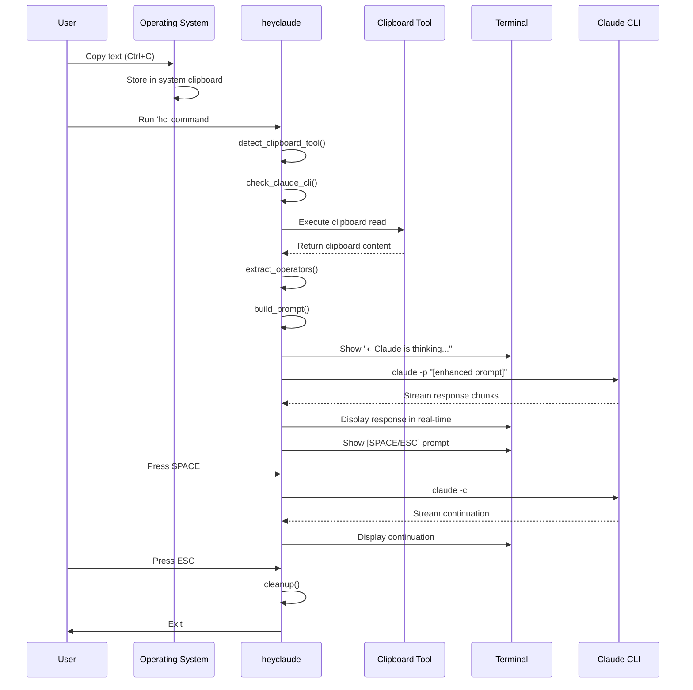

# Hey Claude - Sequence Diagrams

This document illustrates the sequence of interactions between system components during Hey Claude operations.

## Main Execution Sequence



## Detailed Component Interactions

### 1. Startup and Detection Phase

```
┌─────┐    ┌──────────┐    ┌───────────┐    ┌──────────┐
│User │    │heyclaude │    │OS Tools   │    │Claude CLI│
└──┬──┘    └────┬─────┘    └─────┬─────┘    └────┬─────┘
   │            │                 │                │
   │ Run 'hc'   │                 │                │
   ├───────────►│                 │                │
   │            │                 │                │
   │            │ Check xclip     │                │
   │            ├────────────────►│                │
   │            │◄────────────────┤                │
   │            │ Found ✓         │                │
   │            │                 │                │
   │            │ Check claude    │                │
   │            ├─────────────────┼───────────────►│
   │            │◄────────────────┼────────────────┤
   │            │ Found ✓         │                │
   │            │                 │                │
```

### 2. Input Processing Phase

```
┌──────────┐    ┌────────────┐    ┌─────────────┐
│heyclaude │    │xclip       │    │Input Parser │
└────┬─────┘    └─────┬──────┘    └──────┬──────┘
     │                │                   │
     │ Read clipboard │                   │
     ├───────────────►│                   │
     │◄───────────────┤                   │
     │ "brief: list:  │                   │
     │  explain git"  │                   │
     │                │                   │
     │ Extract operators                  │
     ├───────────────────────────────────►│
     │◄───────────────────────────────────┤
     │ operators=["brief","list"]         │
     │ content="explain git"              │
     │                                    │
```

### 3. Claude Interaction Phase

```
┌──────────┐    ┌──────────┐    ┌───────────┐    ┌──────────┐
│heyclaude │    │Terminal  │    │Claude CLI │    │Claude API│
└────┬─────┘    └────┬─────┘    └─────┬─────┘    └────┬─────┘
     │               │                 │                │
     │ Show spinner  │                 │                │
     ├──────────────►│                 │                │
     │               │◐ Thinking...    │                │
     │               │                 │                │
     │ claude -p "..." │               │                │
     ├─────────────────┼──────────────►│                │
     │                 │               │ API Request   │
     │                 │               ├───────────────►│
     │                 │               │                │
     │                 │               │◄───────────────┤
     │◄────────────────┼───────────────┤ Response chunk │
     │ Clear spinner   │               │                │
     ├────────────────►│               │                │
     │                 │               │                │
     │ Stream chunk    │               │                │
     ├────────────────►│               │                │
     │                 │ "Git is a..." │                │
     │                 │               │                │
     │◄────────────────┼───────────────┤ More chunks   │
     │ Stream chunk    │               │                │
     ├────────────────►│               │                │
     │                 │               │                │
```

### 4. Continuation Flow

```
┌─────┐    ┌──────────┐    ┌──────────┐    ┌───────────┐
│User │    │heyclaude │    │Terminal  │    │Claude CLI │
└──┬──┘    └────┬─────┘    └────┬─────┘    └─────┬─────┘
   │            │                │                │
   │            │ Show prompt    │                │
   │            ├───────────────►│                │
   │            │                │ [SPACE/ESC]    │
   │            │                │                │
   │ Press SPACE│                │                │
   ├───────────►│                │                │
   │            │                │                │
   │            │ Restore TTY    │                │
   │            ├───────────────►│                │
   │            │                │                │
   │            │ claude -c      │                │
   │            ├────────────────┼───────────────►│
   │            │                │                │
   │            │◄───────────────┼────────────────┤
   │            │                │ Continuation   │
   │            │ Stream         │                │
   │            ├───────────────►│                │
   │            │                │                │
```

## Error Handling Sequences

### Empty Clipboard Error

```
┌─────┐    ┌──────────┐    ┌───────────┐
│User │    │heyclaude │    │Clipboard  │
└──┬──┘    └────┬─────┘    └─────┬─────┘
   │            │                 │
   │ Run 'hc'   │                 │
   ├───────────►│                 │
   │            │                 │
   │            │ Read clipboard  │
   │            ├────────────────►│
   │            │◄────────────────┤
   │            │ "" (empty)      │
   │            │                 │
   │            │ Show error      │
   │◄───────────┤                 │
   │ "📋 Nothing │                 │
   │ in clipboard"                │
   │            │                 │
   │            │ Exit(0)         │
   │◄───────────┤                 │
```

### Missing Claude CLI Error

```
┌─────┐    ┌──────────┐    ┌────────────┐
│User │    │heyclaude │    │System      │
└──┬──┘    └────┬─────┘    └──────┬─────┘
   │            │                  │
   │ Run 'hc'   │                  │
   ├───────────►│                  │
   │            │                  │
   │            │ Check claude cmd │
   │            ├─────────────────►│
   │            │◄─────────────────┤
   │            │ Not found        │
   │            │                  │
   │            │ Show error       │
   │◄───────────┤                  │
   │ "⚠️ Claude  │                  │
   │ CLI not     │                  │
   │ installed"  │                  │
   │            │                  │
   │            │ Exit(1)          │
   │◄───────────┤                  │
```

### User Interruption (Ctrl+C)

```
┌─────┐    ┌──────────┐    ┌───────────┐    ┌─────────┐
│User │    │heyclaude │    │Claude CLI │    │Signal   │
└──┬──┘    └────┬─────┘    └─────┬─────┘    └────┬────┘
   │            │                 │                │
   │            │ Streaming...    │                │
   │            │◄────────────────┤                │
   │            │                 │                │
   │ Ctrl+C     │                 │                │
   ├───────────►│                 │                │
   │            │                 │                │
   │            │◄────────────────┼────────────────┤
   │            │ SIGINT          │                │
   │            │                 │                │
   │            │ Kill claude     │                │
   │            ├────────────────►│                │
   │            │                 │                │
   │            │ cleanup()       │                │
   │            ├─────────────────┤                │
   │            │                 │                │
   │            │ Show message    │                │
   │◄───────────┤                 │                │
   │"Interrupted.│                 │                │
   │ Goodbye!"   │                 │                │
   │            │                 │                │
```

## Operator Processing Sequence

### Complex Operator Chain

```
Input: "brief: list: code only: fix Python error"

┌────────────────┐    ┌──────────────┐    ┌──────────────┐
│Operator Parser │    │Prompt Builder│    │Claude CLI    │
└───────┬────────┘    └──────┬───────┘    └──────┬───────┘
        │                     │                    │
        │ Extract "brief:"    │                    │
        ├────────────────────►│                    │
        │                     │                    │
        │ Extract "list:"     │                    │
        ├────────────────────►│                    │
        │                     │                    │
        │ Extract "code only:"│                    │
        ├────────────────────►│                    │
        │                     │                    │
        │ operators=[brief,   │                    │
        │  list, code_only]   │                    │
        │ content="fix Python │                    │
        │  error"             │                    │
        │                     │                    │
        │                     │ Build prompt       │
        │                     ├───────────────────►│
        │                     │ "Please provide   │
        │                     │  a brief response │
        │                     │  (1-2 sentences). │
        │                     │  Format as bullet │
        │                     │  list. Respond    │
        │                     │  with only code.  │
        │                     │                    │
        │                     │  User: fix Python │
        │                     │  error"            │
        │                     │                    │
```

## Configuration Loading Sequence

```
┌──────────┐    ┌─────────────┐    ┌──────────────┐
│heyclaude │    │File System  │    │Config Parser │
└────┬─────┘    └──────┬──────┘    └──────┬───────┘
     │                 │                   │
     │ Check config    │                   │
     ├────────────────►│                   │
     │ ~/.config/      │                   │
     │ heyclaude/      │                   │
     │ config          │                   │
     │                 │                   │
     │◄────────────────┤                   │
     │ File exists     │                   │
     │                 │                   │
     │ Read file       │                   │
     ├────────────────►│                   │
     │◄────────────────┤                   │
     │ Content         │                   │
     │                 │                   │
     │ Parse lines     │                   │
     ├─────────────────┼──────────────────►│
     │                 │                   │
     │◄────────────────┼───────────────────┤
     │ key=value pairs │                   │
     │                 │                   │
     │ Apply overrides │                   │
     ├─────────────────┤                   │
     │ COLOR_PROMPT=   │                   │
     │  "\033[96m"     │                   │
     │                 │                   │
```

## Terminal Launch Sequence

### When Not Already in Terminal

```
┌─────┐    ┌──────────┐    ┌───────────────┐    ┌──────────┐
│User │    │heyclaude │    │Terminal Detect│    │gnome-term│
└──┬──┘    └────┬─────┘    └───────┬───────┘    └────┬─────┘
   │            │                   │                  │
   │ Run from   │                   │                  │
   │ hotkey     │                   │                  │
   ├───────────►│                   │                  │
   │            │                   │                  │
   │            │ Not in TTY        │                  │
   │            ├──────────────────►│                  │
   │            │                   │                  │
   │            │◄──────────────────┤                  │
   │            │ Need terminal     │                  │
   │            │                   │                  │
   │            │ Find terminal     │                  │
   │            ├──────────────────►│                  │
   │            │                   │                  │
   │            │◄──────────────────┤                  │
   │            │ gnome-terminal    │                  │
   │            │                   │                  │
   │            │ exec gnome-terminal --geometry      │
   │            │  80x24 --title 'Hey Claude' --      │
   │            │  /usr/local/bin/heyclaude           │
   │            ├─────────────────────────────────────►│
   │            │                                      │
   │◄──────────┼──────────────────────────────────────┤
   │            │ New window opens                     │
   │            │ Script re-runs in terminal           │
```

## Performance Timeline

### Millisecond-by-Millisecond Execution

```
Time (ms)  Component        Action
────────── ──────────────── ─────────────────────────────────
0          OS               User invokes 'hc'
5          Bash             Script loaded and parsed
10         heyclaude        Signal handlers registered
15         heyclaude        detect_clipboard_tool() starts
20         heyclaude        xclip found and verified
25         heyclaude        check_claude_cli() starts
30         heyclaude        claude command verified
35         heyclaude        Terminal detection complete
40         heyclaude        Configuration loaded (if exists)
45         Clipboard        Content read via xclip
50         Parser           Operators extracted
55         Parser           Prompt enhanced
60         Terminal         Spinner animation starts
65         Claude CLI       Process spawned
70         Terminal         "◐ Claude is thinking..." shown
100        Claude API       Network request initiated
500        Claude API       First response chunk
505        Terminal         Spinner cleared
510        Terminal         First text displayed
1000       Claude API       Response streaming continues
2000       Claude API       Response complete
2005       Terminal         Continuation prompt shown
```

## State Transitions

### Main State Machine

```
stateDiagram-v2
    [*] --> Startup
    Startup --> Detection: Script launched
    Detection --> InputReading: Tools found
    Detection --> Error: Tool missing
    InputReading --> Processing: Clipboard has content
    InputReading --> Error: Clipboard empty
    Processing --> ClaudeQuery: Prompt built
    ClaudeQuery --> Streaming: Response started
    Streaming --> WaitingForUser: Response complete
    WaitingForUser --> ClaudeQuery: User pressed SPACE
    WaitingForUser --> Cleanup: User pressed ESC
    Error --> [*]
    Cleanup --> [*]
```

### Response Streaming States

```
stateDiagram-v2
    [*] --> ShowSpinner
    ShowSpinner --> ExecuteClaude: Spinner started
    ExecuteClaude --> ReceiveChunk: Claude responds
    ReceiveChunk --> ClearSpinner: First chunk
    ClearSpinner --> DisplayChunk: Spinner removed
    DisplayChunk --> ReceiveChunk: More chunks
    DisplayChunk --> Complete: No more chunks
    Complete --> [*]
```

## Component Responsibilities

### Process Hierarchy During Execution

```
heyclaude (PID: 12345)
│
├─ xclip -selection clipboard -o (PID: 12346) [exits immediately]
│
├─ spinner background subshell (PID: 12347)
│  └─ sleep 0.1 [repeating]
│
└─ claude -p "..." (PID: 12348) [long-running]
   └─ node /usr/local/bin/claude [handles API communication]
```

## Key Timing Considerations

1. **Clipboard Read**: Must complete within 50ms
2. **Spinner Start**: Must appear before 100ms
3. **First Response**: User sees text within 500ms typical
4. **Continuation Choice**: Instant (raw terminal mode)
5. **Cleanup**: All processes killed within 10ms

This sequence design ensures minimal latency at each step while maintaining clean process management and error handling.